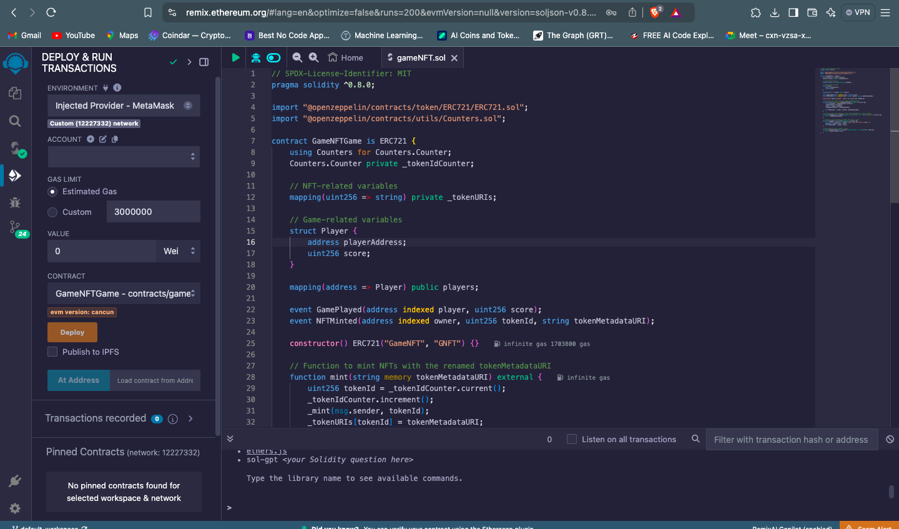
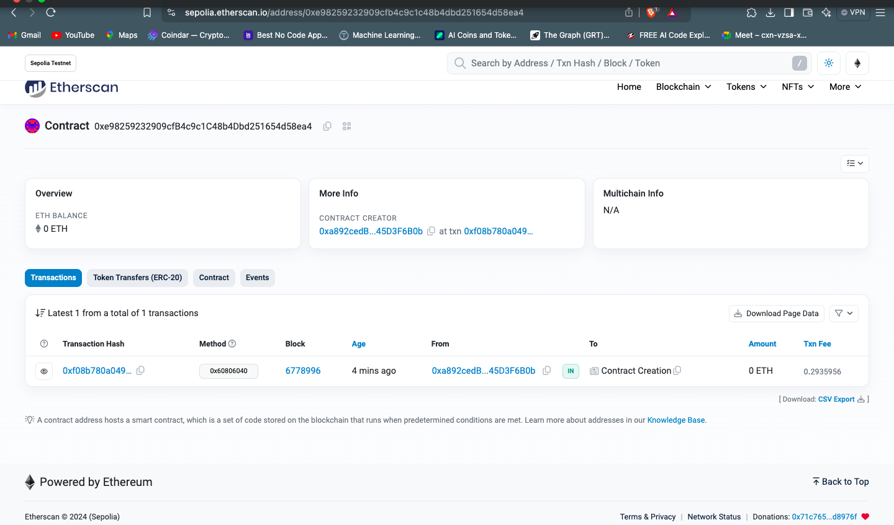

## 🎮 Run and Earn - A Crypto Mining Game Title

Run🏃‍♂and Earn💎 is a decentralized, blockchain-powered game that offers a unique and engaging experience for cryptocurrency enthusiasts. Players can play your game and potentially earning cryptocurrency rewards in the form of points. 💰. The game's innovative use of blockchain technology ensures transparency, fairness, and security, making it a reliable and exciting platform for players.

## Deployment Links 

https://remix.ethereum.org/#lang=en&optimize=false&runs=200&evmVersion=null&version=soljson-v0.8.26+commit.8a97fa7a.js

## Game Mechanics and Gameplay
<video controls src="WhatsApp Video 2024-09-29 at 12.13.12_cb8f73f6.mp4" title="Title"></video>

## contract address.

https://sepolia.etherscan.io/address/0xe98259232909cfb4c9c1c48b4dbd251654d58ea4

## 🎮How to Play

- The game starts with the character in a designated starting position.

- The player uses the arrow keys to move the character.

- If the character collides with an obstacle, the game ends. ❌

- If the character collides with a coin, the coin is collected, and the player's cryptocurrency balance is updated. 💰

- The game continues until the player loses or decides to quit.

## 👥Team Members

👨‍💻Kunal Sood (kunalsood256@gmail.com)

👨‍🎨Lakshya Tomar (lakshyatomar0110@gmail.com)

👨‍🎨 Nishant (nishantstar400@gmail.com)

👨‍💻 Rohan (rohankardam0@gmail.com)

## contact details

- 📧 e-mail: kunalsood256@gmail.com

- 📸 Instagram: https://www.instagram.com/_.kunal._15/?igsh=MXZ3eG5qYXdnbnRtcQ%3D%3D

- ✖️ X(twitter): https://x.com/Kunal75149721?t=UNbRrDdJGBz-w4t2bXg2oA&s=09

- 🔗linkedin: https://www.linkedin.com/in/kunal-sood-3b993225b/

## ✨ Features of the Game and Platform
🎮 Play-to-Earn Blockchain Game

Earn cryptocurrency rewards: Players can earn cryptocurrency tokens based on the outcome on the basis of score.

Progressive rewards: The game may introduce progressive rewards or bonuses for achieving certain milestones or streaks.

🔗 Integration with Cryptocurrency Wallets

Seamless wallet connectivity: Players can easily connect their cryptocurrency wallets to the game, allowing for convenient deposit and withdrawal of funds.

Supported wallets: The game supports wallets like MetaMask and Bybit, providing a smooth experience for users.

⛏ In-Game Mining and Rewards System

- Mining mechanics: Players can earn cryptocurrency through in-game activities, such as completing challenges or participating in special events.

- Reward structure: Rewards are distributed based on player performance and milestones.

🔒 Blockchain-Powered Security and Transparency

- Immutable records: All game transactions and data are stored on the blockchain, ensuring they cannot be altered or tampered with.

- Security: Blockchain technology provides a secure and reliable environment for players, protecting their assets and preventing fraud.

## Smart Contract Details:
⛏ MiningContract.sol

- Purpose: This contract handles the logic for mining activities within the game. It keeps track of each player’s mining activity, verifies the mined resources, and calculates the rewards based on the player's performance.

- How it works:

    🏗 Players call the startMining() function to initiate the mining process.

    ✅ The contract verifies that the player is eligible to mine (checking for any cooldown or account status).

    🎉 Once mining is complete, the contract calculates the amount of crypto to reward the player based on predefined game rules.

💰 TokenContract.sol

- Purpose: This contract manages the in-game tokens. It handles minting new tokens, transferring them between players, and allowing withdrawals to external wallets.

- How it works:

    🛠 Tokens are minted when players achieve certain milestones in the game (e.g., when they complete mining tasks).

    💸 Players can use the withdraw() function to transfer their earned tokens from the game to their connected crypto wallet.

    🔒 The contract also ensures that only valid addresses can receive withdrawals and that the total supply of tokens stays within the allowed limits.

### How the Contracts Operate.
⛏ MiningContract.sol:

- StartMining(): This function allows a player to begin mining. It checks for conditions such as the player’s eligibility and the current block timestamp to ensure they can mine again.

- ClaimReward(): Once mining is complete, players can claim their reward. The function calculates the amount of reward based on the player's activity and updates the contract’s state to ensure rewards are distributed fairly.

💰 TokenContract.sol:

- Mint(): This function is triggered automatically when a player reaches a milestone or wins a reward. It mints a new amount of tokens, which are credited to the player’s in-game account.

- Withdraw(): Players can call this function to move their tokens out of the game and into their crypto wallet. The function checks that the player has a sufficient balance before executing the withdrawal

### Technologies Used
🔗 Blockchain:  Neo X (Solidity)

The  game is built on the Neo X blockchain, a high-performance platform designed for building decentralized applications (dApps). Neo X allows us to leverage blockchain technology to create a secure, transparent, and decentralized environment for users to engage in crypto mining.

💻 Frontend: JavaScript

Our front end is powered by JavaScript, offering a dynamic and interactive gaming experience. Through Web3.js, JavaScript communicates with the blockchain, enabling users to mine, sign transactions, and track real-time rewards.

⚙ Backend: Node.js

The backend runs on Node.js, ensuring smooth interactions between the frontend, blockchain, and wallets. Node.js handles blockchain transactions, game session management, and real-time data, ensuring secure integration with the NEO X network.

🔐 Wallet Integration:

MetaMask We’ve integrated MetaMask, allowing players to securely connect their wallets to the game. With MetaMask, users can:
- Sign in with their NEO X wallet.
- Receive mining rewards directly.
- Withdraw tokens to external wallets or convert them to real currency.

MetaMask bridges the game and NEO X, offering a seamless and secure experience for managing assets

## future scope.

We will be using Premium Version which will be giving extra benefit and  facility like cashback, More bonuses And mining with team